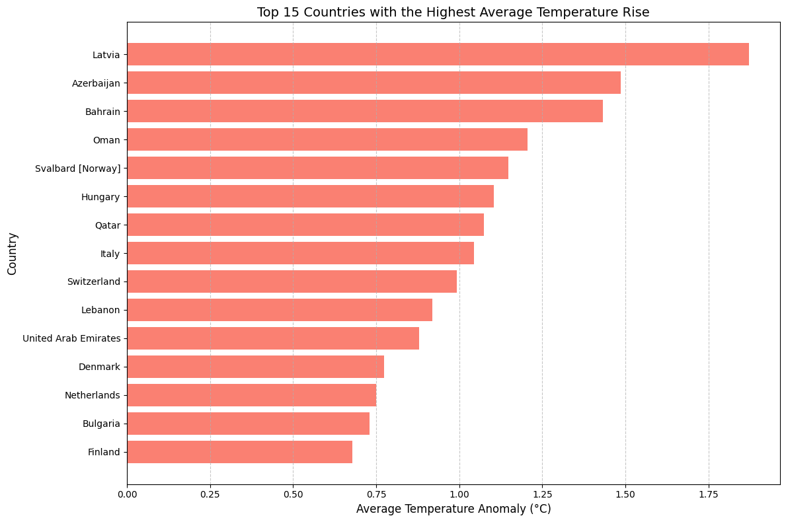
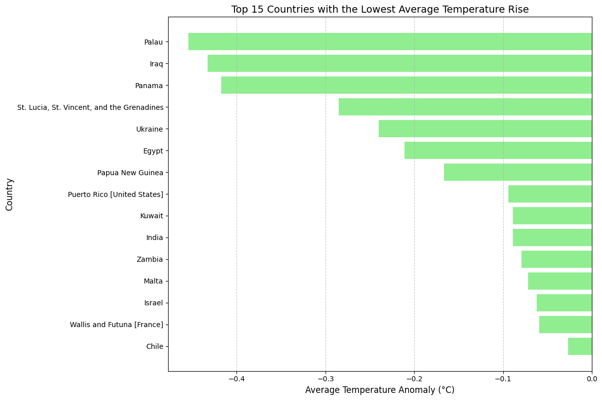
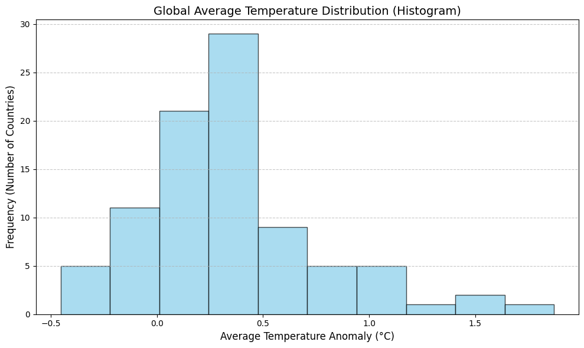
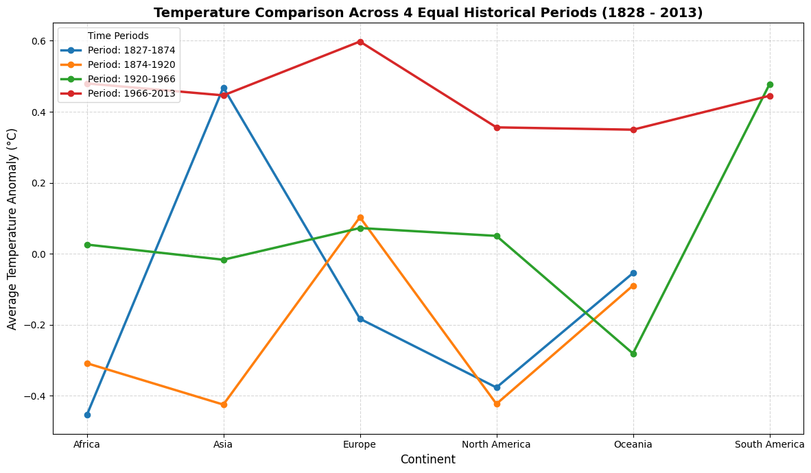
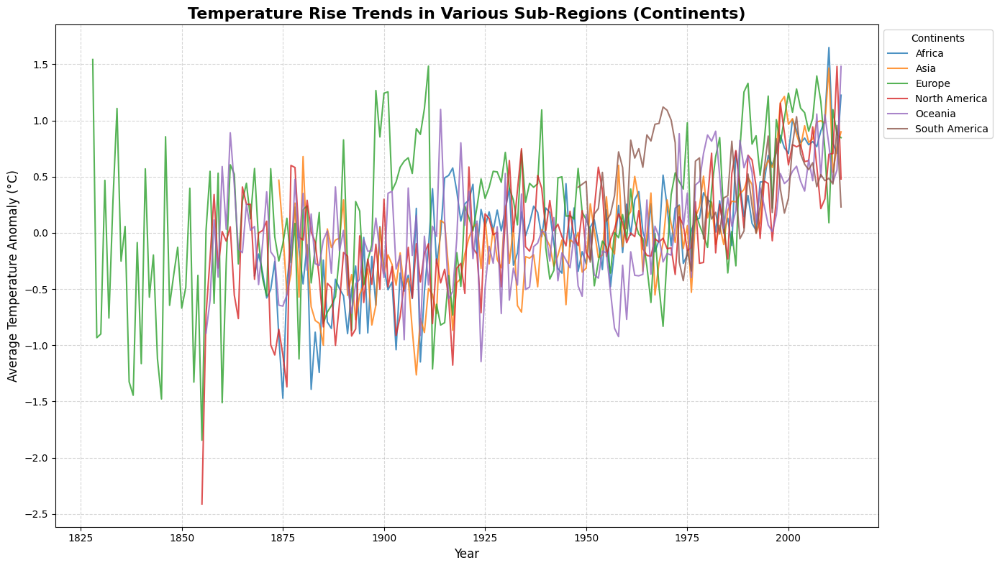
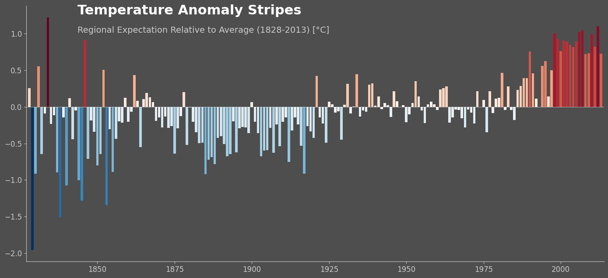

# About The Project
Analyzed and visualized temperature anomalies from 500 Berkeley Earth stations across 7 continents. Performed data cleaning using linear interpolation for missing values and created visual charts of temperature rises.

(<a href="#readme-top">back to top</a>)

# Data Collection Method
Automated web scraping from the Berkeley Earth [station list](https://data.berkeleyearth.org/station-list/) and individual data [files](https://data.berkeleyearth.org/auto/Stations/TAVG/Text/15146-TAVG-Data.txt).

(<a href="#readme-top">back to top</a>)

# Built With
* 
* 
* 
* 
* 
* 
* 
* 

(<a href="#readme-top">back to top</a>)

# Sample Visualizations

(<a href="#readme-top">back to top</a>)

